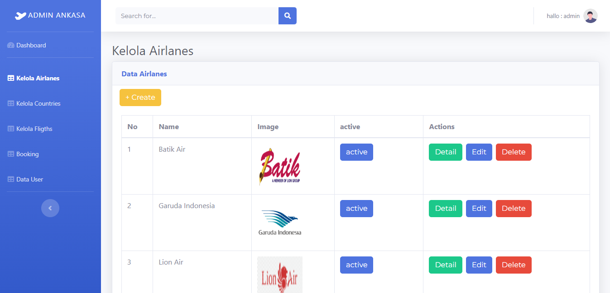
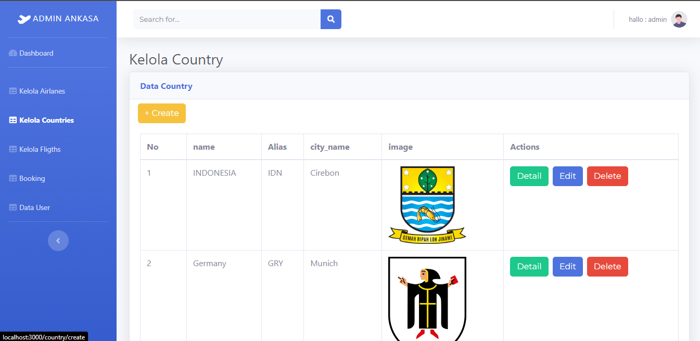
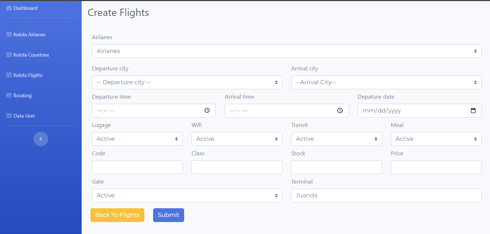
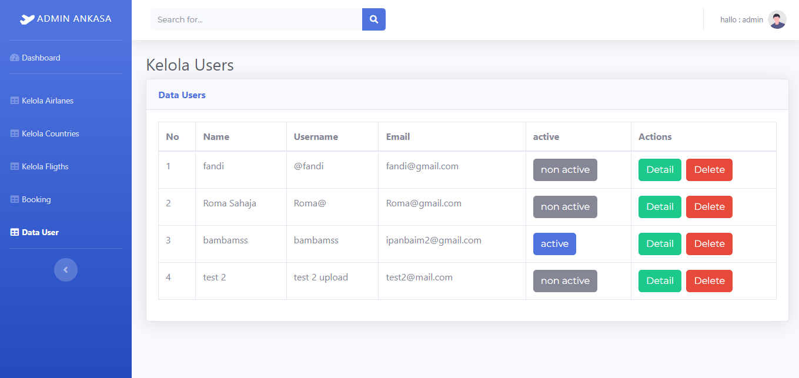

# Admin Ankasa Tiketing
Ankasa Flight is an online ticket booking application. This application is intended for people who want to travel both nationally and internationally, using airplanes.


## Page
* Login
* kelola airlanes
* Kelola country
* Kelola flights
* Kelola Booking
* Kelola user

## Installation
### Clone
```
$ git https://github.com/wahyuwww/Ankasa-Ticketing-FE.git
$ cd Ankasa-Ticketing-FE
```

## Link Netlify
[Ankasa Tiketing](https://admin-angkasa-group.netlify.app/)


In the project directory, you can run:

### `npm start`

Runs the app in the development mode.\
Open [http://localhost:3000](http://localhost:3000) to view it in your browser.

The page will reload when you make changes.\
You may also see any lint errors in the console.

### `npm test`

Launches the test runner in the interactive watch mode.\
See the section about [running tests](https://facebook.github.io/create-react-app/docs/running-tests) for more information.

### `npm run build`


## Screenshots
<div align="center">
     
    
     
    
</div>